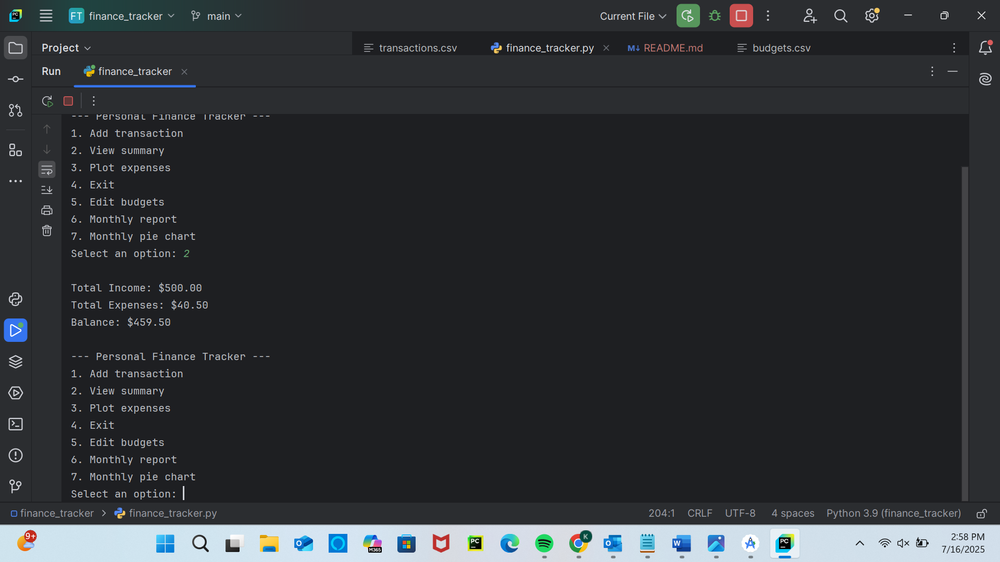
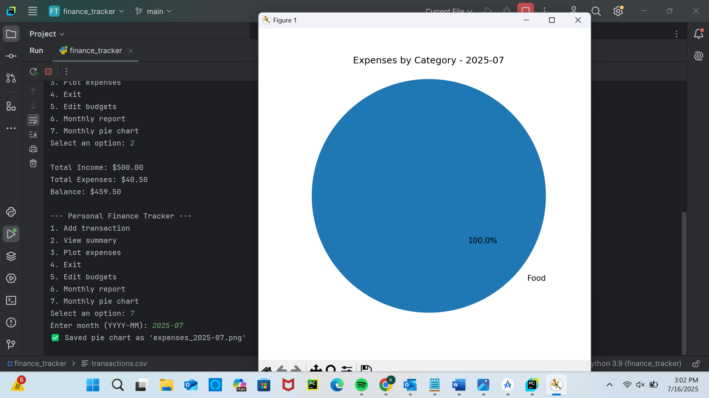

# 💰 Personal Finance Tracker (Python CLI)

Track your income, expenses, monthly budgets, and visualize your spending with charts — all from the command line!

---

## ✨ Features

- 📥 Add income and expense transactions
- 🧾 Automatically log and save all data to `transactions.csv`
- 📊 Monthly summary reports with income, expenses, and top 3 categories
- 📈 Bar and pie charts to visualize spending (via `matplotlib`)
-  Set monthly budget limits and get warnings if you overspend
- 🛠 Edit budget limits directly from the app
- 📝 Export monthly reports to `monthly_report.txt`
- 🖼️ Save pie charts to PNG files for sharing or analysis

---

## 📸 Screenshots

### Terminal App


### Monthly Pie Chart


---

## 🛠 Technologies
- Python 3
- `csv`, `datetime`, `collections`
- [Matplotlib](https://matplotlib.org/)

---

## 🚀 How to Run

```bash
pip install matplotlib
python finance_tracker.py
